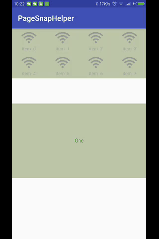
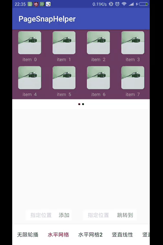
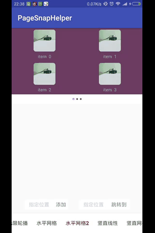
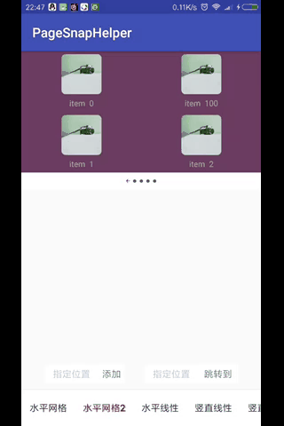
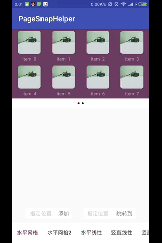

# PageRecyclerView
PageRecyclerView实现翻页功能及无限轮播。

## 效果演示
| 无限轮播     | 水平网格分页    | 添加数据    |
| ------------ | ------------------------- | ----------- |
|  |  |  |

| 移除数据  | 竖直线性分页 |
| ------------ | ------------------------- |
|  |  |

## Demo
[下载 APK](apk/app-debug.apk)

## 依赖
### 添加依赖：
```
	dependencies {
		implementation 'ckrjfrog.Page:PageView:1.0.7'//gradle plugin 3.0(包含)以上使用
		//compile 'ckrjfrog.Page:PageView:1.0.7'//gradle plugin 3.0一下使用
	}
```

## 功能及使用
### 1.布局引用
```
     <com.ckr.pageview.view.PageView
        android:id="@+id/pageView"
        android:layout_width="match_parent"
        android:layout_height="wrap_content"
        app:page_background="#80000000"
        app:endless_loop="true"
        app:loop_interval="3000"
        app:hide_indicator="false"
        app:indicator_group_height="@dimen/viewpager_indicator_group_height"
        app:indicator_group_width="@dimen/viewpager_indicator_group_height"
        app:indicator_margin="@dimen/viewpager_indicator_margin"
        app:layout_flag="grid"
        app:orientation="horizontal"
        app:page_column="four"
        app:page_row="two"
        app:selected_indicator_color="@color/viewpager_selected_indicator_color"
        app:selected_indicator_diameter="@dimen/viewpager_selected_indicator_diameter"
        app:selected_indicator_drawable="@drawable/shape_point_selected"
        app:unselected_indicator_color="@color/viewpager_unselected_indicator_color"
        app:unselected_indicator_diameter="@dimen/viewpager_unselected_indicator_diameter"
        app:unselected_indicator_drawable="@drawable/shape_point_unselected"/>
```
### 2.属性说明
| 属性							| 描述									 | 类型			| 默认值			|
| ----------------------------- | -------------------------------------- | ----------   | ------------- |
| endless_loop                  | 是否启动无限轮播(当每页只有一个item时有效)	 | boolean  	| false			|
| loop_interval                 | 轮询时间间隔							 | int			| 3000			|
| hide_indicator                | 是否隐藏指示器  						 | boolean 		| false		 	|
| indicator_group_heigt         | 指示器父容器的高度 						 | int     		| 90			|
| indicator_group_width         | 指示器父容器的高度 						 | int     		| 90			|
| indicator_margin				| 指示器间的间距  						 | int      	| 15            |
| layout_flag					| 标记线性布局或网格布局  					 | int      		| 0(线性)     	|
| orientation					| 布局方向  								 | int      	| 0(horizontal) |
| page_column					| 每页的列数  							 | int       	| 1		    	|
| page_row						| 每页的行数  							 | int       	| 1		    	|
| selected_indicator_color      | 当前页的指示器颜色  						 | int       	| Color.RED	 	|
| selected_indicator_diameter   | 当前页的指示器直径  						 | int       	| 15		 	|
| selected_indicator_drawable   | 当前页的指示器drawable(优先级高于颜色) 	 | drawable  	| null	     	|
| unselected_indicator_color	| 非当前页的指示器颜色  					 | int      	| Color.BLACK   |
| unselected_indicator_diameter	| 非当前页的指示器直径  					 | int      	| 15 		 	|
| selected_indicator_drawable   | 非当前页的指示器drawable(优先级高于颜色) 	 | drawable 	| null	     	|
| page_background				| 当前页的背景							 | drawable		| null			|

### 3.代码使用
```
    mainAdapter = new MainAdapter(getContext(), itemLayoutId);//该MainAdapter需继承BasePageAdapter<T,ViewHolder>
    pageView.setAdapter(mainAdapter);//设置adapter
    pageView.updateAll(items);//更新数据
```

License
-------

    Copyright 2018 ckrgithub

    Licensed under the Apache License, Version 2.0 (the "License");
    you may not use this file except in compliance with the License.
    You may obtain a copy of the License at

       http://www.apache.org/licenses/LICENSE-2.0

    Unless required by applicable law or agreed to in writing, software
    distributed under the License is distributed on an "AS IS" BASIS,
    WITHOUT WARRANTIES OR CONDITIONS OF ANY KIND, either express or implied.
    See the License for the specific language governing permissions and
    limitations under the License.
